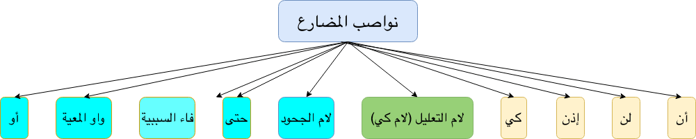
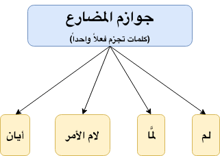
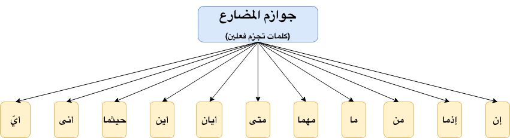

**Fi'l Mudhari**{: .firstword} Or **فعل مضارع**{: .firstword .arabic} is used to express an action in the present or an action that will happen in the future.

## How to identify Fi'l Mudhari in Arabic Grammar  
**ما علامة فعل مضارع**{: .arabic}

 

- فعل مضارع **Always** begins with words ن – أ - ي - ت which is also called as **أحرف المضارعة** which is put in one-word نأيت. One point to note is these are *NOT 100% sure علامات* of فعل مضارع because there are nouns also that begin with ن – أ - ي - ت.
- If we can put لم in front of a verb, then it is فعل مضارع

## Characteristics of Fi'l Mudhari
Fi'l Mudhari is Mo'rab (معرب) and has following 3 states

### الرفع
Fi'l Mudhari is in Raf form when it is not preceded with a harf that will make it Nasb or Jazm
> يُرْفَعُ الفعل المضارع إذا لم يسبقْه ناصبٌ ولا جازمٌ

Examples:
- يكت**بُ**{: .bg-yellow} الطالب الدرس
- لا يكت**بُ**{: .bg-yellow} الطالب الدرس

### نصب
Fi'l Mudhari is in Nasb form when it is preceded with a harf that will make it Nasb.
> ينصب الفعل المضارع إذا سبقه ناصب

Example: لن يكت**بَ**{: .bg-yellow} الطالب الدرس

### جزم
Fi'l Mudhari is in Jazm form when it is preceded with a harf that will make it Jazm.
> يجزم الفعل المضارع إذا سبقه جازم

Example: لم يكت**بْ**{: .bg-yellow} الطالب الدرس

 

**Exception:**{: .exception} In the following two cases, Fi'l Mudhari is not Mo'rab.  
**Case 1:**{: .heading1} When نون النسوة is added to it (إذا اتصلت به نون النسوة), then it is Mabni with Sukoon (يبنى على السكون)
  - الطالبات **يكتبْنَ**{: .bg-yellow} الدرس
  - الطالبات لن **يكتبْن**{: .bg-yellow} الدرس
  - الطالبات لم **يكتبْن**{: .bg-yellow} الدرس
  > **يكتبْن**{: .arabic .irab}
  فعل مضارع مبني على السكون لاتصاله بنون النسوة

 

**Case 2:**{: .heading1} When نون التوكيد is added to it (إذا اتصلت به نون التوكيد), then it is Mabni with Fatha (يبنى على الفتح)
  - **لأكتبَنَّ**{: .bg-yellow} الدرس غداً

 

**Rule**  
> الفعل المضارع معرب إلا إذا اتصلت به نون النسوة أو نون التوكيد

 

The I'rab of Fi'l Mudhari gets tricky when it has Harf Illa (و,ا, ي) in the end. Let's look into it one by one,

 

**Case 1**{: .heading1} **When الألف comes at the end (فعل مضارع معتل الآخر بالألف)**{: .heading2}
- **يرضى**{: .bg-yellow} الله عن المؤمنين
  - **الرفع**{: .bg-cyan}: تقدر عليه الضمة
  > **يرضى**{: .arabic .irab}
   فعل مضارع مرفوع لأنه لم يسبقه ناصب ولا جازم وعلامة رفعه الضمة المقدرة على  الألف منع من ظهورها التعذر  
   where التعذر means Impossibile to add damma
- لن **يرضى**{: .bg-yellow} الله عن الكافرين
  - **النصب**{: .bg-cyan}: تقدر الفتحة
  > **يرضى**{: .arabic .irab}
   فعل مضارع منصوب وعلامة نصبه الفتحة المقدرة منع من ظهورها التعذر  
   where التعذر means Impossibile to add fatha
- لم **يرضَ**{: .bg-yellow} الله عن الكافرين
  - **الجزم**{: .bg-cyan}: يحذف حرف العلة
  > **يرضَ**{: .arabic .irab}
  (فعل مضارع مجزوم وعلامة جزمه حذف حرف العلة (الألف

 

**Case 2**{: .heading1} **When الياء comes at the end (فعل مضارع معتل الآخر بالياء)**{: .heading2}
  - **يمشيْ**{: .bg-yellow} الطالب إلى البيت
    - **الرفع**{: .bg-cyan}: تقدر عليه الضمة
    > **يمشيْ**{: .arabic .irab}
     فعل مضارع مرفوع لأنه لم يسبقه ناصب ولا جازم وعلامة رفعه الضمة المقدرة على الياء منع من ظهورها الثقل  
     where الثقل is Heaviness meaning its difficult to add damma
  - لن **يمشيَ**{: .bg-yellow} الطالب إلى البيت
    - **النصب**{: .bg-cyan}: تظهر الفتحة
    > **يمشيَ**{: .arabic .irab}
     فعل مضارع منصوب ب (لن) وعلامة نصبه الفتحة الظاهرة
  - لم **يمشِ**{: .bg-yellow} الطالب إلى البيت
    - **الجزم**{: .bg-cyan}: يحذف حرف العلة
    > **يمشِ**{: .arabic .irab}
     (فعل مضارع مجزوم وعلامة جزمه حذف حرف العلة (الياء

 

 **Case 3**{: .heading1} **When الواو comes at the end (فعل مضارع معتل الآخر بالواو)**{: .heading2}
  - **يدعُوْ**{: .bg-yellow} المؤمن إلى الخير
    - **الرفع**{: .bg-cyan}: تقدر عليه الضمة
     > **يدعُوْ**{: .arabic .irab}
     فعل مضارع مرفوع لأنه لم يسبقه ناصب ولا جازم وعلامة رفعه الضمة المقدرة على الواو منع من ظهورها الثقل  
     where الثقل is Heaviness meaning its difficult to add damma
  - لن **يدعوَ**{: .bg-yellow} المؤمن إلى الشر
    - **النصب**{: .bg-cyan}: تظهر الفتحة
    > **يدعوَ**{: .arabic .irab}
     فعل مضارع منصوب ب (لن) وعلامة نصبه الفتحة الظاهرة
  - لم **يدعُ**{: .bg-yellow} المؤمن إلى الشر
    - **الجزم**{: .bg-cyan}: يحذف حرف العلة
    > **يدعُ**{: .arabic .irab}
     (فعل مضارع مجزوم وعلامة جزمه حذف حرف العلة(الواو

 

That was quite a lot !!! I know, but

 

**Have you ever wondered what makes Fi'l Mudhari Mansoob?**

 

Lets find out in

## **نواصب المضارع**{: .arabic}

نواصب المضارع are 10
- **أن**{: .bg-yellow}
- **لن**{: .bg-yellow}
- **إذن**{: .bg-yellow}
- **كي**{: .bg-yellow}
- **(لام التعليل (لام كي**{: .bg-green}
- **لام الجحود**{: .bg-cyan}
- **حتى**{: .bg-cyan}
- **فاء السببية**{: .bg-cyan}
- **واو المعية**{: .bg-cyan}
- **أو**{: .bg-cyan}

{:title="10 Nawasib of Mudhari"}

 

Kufi group say, 
> All above 10 الكلمات make Fi'l Mudhari Mansoob

 

Basri group say,
> Only 4 الكلمات (highlighted in yellow) make Fi'l Mudhari Mansoob. For rest 6 الكلمات there is a presence of Hidden أن, i.e., أن مضمرة which make Fi'l Mudhari Mansoob. 

> **Green Category** is made Mansoob with أن مضمرة جوازاً implying we can put أن in the sentence or can hide it.  
**Cyan Category** is made Mansoob with أن مضمرة وجوبا implying we *CAN NOT* put أن in the sentence.

 

Let's look into each harf, beginning with

### أن

 

> أن is حرف نصب ومصدر واستقبال

 

- It is called مصدر because we can replace أن + الفعل with Masdar Muawwal ( مصدر مؤول)  
  - Example: أريد **أن أطلبَ**{: .bg-yellow} العلم can be replaced with أريد **طلبَ**{: .bg-yellow} العلم
- It is called استقبال because we can use it with الفعل to mean an event about the future.

### لن

 

> لن is حرف نفي ونصب واستقبال  

 

Example: **لن**{: .bg-yellow} أقرأَ الكتاب
> **أقرأ**{: .arabic .irab}
 فعل مضارع منصوب ب (لن) وعلامة نصبه الفتحة

### كي

 

> كي is حرف نصب ومصدر واستقبال  

Example: جئت **كي**{: .bg-yellow} أتعلمَ اللغة

 

Similar to ان we have كي + الفعل = مصدر مؤول  
Above sentence can be replaced with جئت **لتعلم**{: .bg-yellow} اللغة Or جئت **لكي**{: .bg-yellow} أتعلمَ اللغة. Where the ل is called لام تعليل 

### إذن

 

> إذن is حرف جواب وجزاء

 

We usually don't use this harf.

 

It is called جواب because we don't start our speech with إذن  
An example in the following conversation, 
- سأزورك غداً
- **إذن**{: .bg-yellow} أكرمَك

 

Conditions (شروط) of إذن
- It has to come as the first word of a sentence of reply. (أن تكون واقعة في أول جملة الجواب)
- The verb that comes after it has to have the meaning of future (أن أن يكون الفعل بعدها يدل على الاستقبال)
- Nothing should come between إذن and the verb (ألا يفصل شيء بينها وبين الفعل)

### لام التعليل

 

> لام التعليل is حرف تعليل ونصب

Example: جئت **لأطلبَ**{: .bg-yellow} العلم
> **أطلبَ**{: .arabic .irab}
 Kufi Irab: فعل مضارع منصوب ب (لام التعليل) وعلامة نصبه الفتحة  
 Basri Irab: فعل مضارع منصوب ب (أن) مضمرة جوازاً وعلامة نصبه الفتحة  
 جوازاً implies sometimes we hide أن and sometimes we pronounce أن

### لام الجحود

 

> لام الجحود is حرف نصب و نفي (where الجحود = النفي)

Example: **ما كان**{: .bg-yellow} المسلم **ل****يشربَ**{: .bg-yellow} الخمر(It is not befitting of a Muslim to drink alcohol). This sentence has very strong negation.  

`ما كان (لم يكن) + لام الحجود + الفعل المضارع`

> **يشرب**{: .arabic .irab}
Kufi Irab: فعل مضارع منصوب ب (لام الجحود) وعلامة نصبه الفتحة  
Basri Irab: فعل مضارع منصوب ب (أن) مضمرة وجوباً وعلامة نصبه الفتحة  
وجوباً implies we can't pronounce أن in the sentence

 

Quranic Example:
- **ما كان**{: .bg-yellow} **ل**{: .bg-yellow}يأخذَ أخاه في دين الملك
- **لم يكن**{: .bg-yellow} الله **ل**{: .bg-yellow}يغفرَ لهم

### حتى

 

> حتى is (حرف نصب وتعليل أو بمعنى (إلى أن  

Example: جئت حتى **أطلبَ**{: .bg-yellow} العلم
> **أطلبَ**{: .arabic .irab}
 Kufi Irab: فعل مضارع منصوب ب (حتى) وعلامة نصبه الفتحة  
 Basri Irab: فعل مضارع منصوب ب (أن) مضمرة وجوباً وعلامة نصبه الفتحة  
 وجوباً implies we can't pronounce أن in the sentence

 

Actually, حتى has two meanings
- حتى in the meaning of إلى أن
  - Example: وكلوا واشربوا **حتى**{: .bg-yellow} يتبينَ الخيط الأبيض
- حتى in meaning of كي
  - Example: أفأنت تكره الناس **حتى**{: .bg-yellow} يكونوا مؤمنين

### فاء السببية

 

> فاء السببية is حرف نصب

 

We call it السببية because what is before ف (e.g., a verb), is a reason for the occurrence (or happening) of what comes after ف i.e. 
> بمعنى أن ما قبلها سبب في حصول ما بعدها

 

For Example in ذاكرْ **ف**{: .bg-yellow}تنجحَ we mean `Studying is the reason for Success`
> **تنجح**{: .arabic .irab}
Kufi Irab: فعل مضارع منصوب ب (الفاء) وعلامة نصبه الفتحة  
Basri Irab: فعل مضارع منصوب ب (أن) مضمرة وجوباً وعلامة نصبه الفتحة  

 

Quranic example: ولا تتبعوا السبل **ف**{: .bg-yellow}تفرقَ بكم عن سبيله

 

Remember فاء السببية works as حرف نصب when it is preceded with following **Nine** cases, viz
- **الأمر**{: .heading1}
  - Example: **ذاكر**{: .bg-yellow} فتنجحَ
- **الدعاء**{: .heading1}
  - Example:**اللهم تب علي**{: .bg-yellow} فأدخلَ الجنة
- **النهي**{: .heading1}
  - Example: **ولا تتبع الهوى**{: .bg-yellow} فيضلَّك عن سبيله
- **السؤال**{: .heading1}
  - Example: **هل ذاكرت**{: .bg-yellow} فتنجحَ؟
- **العرض**{: .heading1} (It means when we offer something, e.g., to offer to one's friend)
  - Example: 
    - **ألا تزورني**{: .bg-yellow} فأكرمَك
    - **ألا تدنو**{: .bg-yellow} فتبصرَ
- **الحضّ**{: .heading1} (It means when we offer something with some force, e.g. parents to his child)
  - Example:**هلَّا ذاكرت**{: .bg-yellow} فتنجحَ
- **التمني**{: .heading1} (Hope for something Impossible OR scarce to happen)
  - Example: 
    - **يا ليتني كنت معهم**{: .bg-yellow} فأفوزَ فوزاً عظيماً
    - **ليت الشبابَ يعود يوماً**{: .bg-yellow} فأخبرَه بما فعل المشيب
- **الرجاء**{: .heading1} (Hope for something possible)
  - Example:
    - **لعل الله يغفر لي**{: .bg-yellow} فأدخلَ الجنة
    - **لعله يزكى .. أو يذكر**{: .bg-yellow} فتنفعَه
- **النفي**{: .heading1}
  - Example:
    - **لا أنام متأخراً**{: .bg-yellow} فأستيقظَ متأخراً
    - **لايقضى عليهم**{: .bg-yellow} فيموتوا

 

All of the above rules are present in the following poetry
> مر وادع وانه وسل واعرض لحضهم  
تمن وارج كذاك النفي قد كملا

 

We can also say,
> قبل فاء السببية يجب أن يكون هناك **نفي** أو **طلب**

 

If we don't see any of the above 9 reasons, then فاء will not work as حرف نصب. For example in يقرأ زيد **فيقرأُ**{: .bg-yellow} عمرو

### واو المعية

 

> واو المعية is (حرف عطف بمعنى (مع

 

For example لا أقرأُ **و**{: .bg-yellow} أشاهدَ التلفاز (I don't read while watching TV)

 

Also, similar to فاء السببية we need to have similar 9 reasons (mentioned above) for واو to behave like حرف نصب

### أو

 

> أو acts as حرف نصب with two meanings

- إلى أن
  - Example: لأستسهلن الصعب **أو** أدركَ المنى (Any problematic thing that I will face, I will make it easy until I reach my dreams)
- إلَّا أن
  - Example: لأقتلن الكافر أو يسلمَ

 

If we see أو with any other meaning, it will not act as حرف نصب

 

Moving on let's look into 

## **الأفعال الخمسة**{: .arabic}

الأفعال الخمسة are 5 special verb forms when ا or و or ي is added to Fi'l Mudhari.
> كل فعل مضارع اتصل به ألف الاثنين أو واو الجماعة أو ياء المخاطبة

 

They are as follows
- يفعلان
- تفعلان
- يفعلون 
- تفعلون 
- تفعلين

 

I'rab of الأفعال الخمسة is done as
- ترفع بثبوت النون
  - Example: الطلاب **يكتبون**{: .bg-yellow} الدرس  
  > **يكتبون**{: .arabic .irab}
   فعل مضارع مرفوع وعلامة رفعه ثبوت النون نيابة عن الضمة لأنه من الأفعال الخمسة  
   واو الجماعة ضمير مبني في محل رفع فاعل
- تنصب بحذف النون
  - Example: الطلاب لن **يكتبوا**{: .bg-yellow} الدرس  
  > **يكتبوا**{: .arabic .irab}
   فعل مضارع منصوب وعلامة نصبه حذف النون نيابة عن الفتحة لأنه من الأفعال الخمسة
- تجزم بحذف النون
  - Example: الطلاب لم **يكتبوا**{: .bg-yellow} الدرس  
  > **يكتبوا**{: .arabic .irab}
    فعل مضارع مجزوم وعلامة جزمه حذف النون نيابة عن السكون لأنه من الأفعال الخمسة

 

**Note:** Pronoun with الأفعال الخمسة is always Marfoo and is not hidden
> الضمير مع الأفعال الخمسة دائما مرفوع وليس هناك ضمير مستتر  

For example:
- يكتب**و**{: .bg-yellow}ن here الواو is فاعل
- يُضرَب**و**{: .bg-yellow}ن here الواو is نائب فاعل
- يكون**و**{: .bg-yellow}ن here الواو is اسم كان

 

**Last but not the least let's look into what makes Fi'l Mudhari Majzoom**

## **جوازم المضارع**{: .arabic}

جوازم المضارع are divided into two categories
- كلمات which affect only one Fi'l Mudhari (كلمات تجزم فعلاً واحداً)
- كلمات which affect two Fi'l Mudhari (كلمات تجزم فعلين)

 

Let's look into each, beginning with 

 

**كلمات تجزم فعلاً واحداً:**{: .heading1} These are four كلمات, viz  
**لم**{: .heading2}  
لم is حرف نفي وجزم وقلب  
Example: **لم**{: .bg-yellow} **يكتبْ**{: .bg-cyan} زيد الدرس, here لم only affected يكتبْ

 

**لمَّا**{: .heading2}  
لمَّا is حرف نفي وجزم وقلب  
Example: **لمَّا**{: .bg-yellow} **يأتِ**{: .bg-cyan} زيد (Zaid didn't come **yet**)

 

**لام الأمر**{: .heading2}  
لام الأمر is حرف للطلب  
Example: 
- **لِ**{: .bg-yellow}يُنفقْ ذو سعة
- اللهم **ل**{: .bg-yellow}تغفرْ لي here we call this لام as لام الدعاء

 

لام الأمر comes with Kasra but if و or ف or ثمّ comes before it then becomes Sakin, e.g. ف**لْ**{: .bg-yellow}يعبدوا

 

**لا الناهية**{: .heading2}  
لا الناهية is حرف لطلب تَرْك الشيء  
Example:
- **لا**{: .bg-yellow} **تكتبْ**{: .bg-cyan} درسك
- ربنا **لا**{: .bg-yellow} **تُزِغْ**{: .bg-cyan} قلوبنا here we call this لا as لا للدعاء

 

{:title="4 of Jawazim of Mudhari"}

 

**كلمات تجزم فعلين:**{: .heading1} These are eleven كلمات, viz  
**إن**{: .heading2}  
Example: **إن**{: .bg-yellow} **تذاكرْ**{: .bg-cyan} **تنجحْ**{: .bg-green}
> **إن**{: .arabic .irab}
 حرف شرط جازم مبني لا محل له من الإعراب

 

> **تذكر**{: .arabic .irab}
 فعل مضارع مجزوم ب (إن) وعلامة جزمه السكون وهو فعل الشرط

 

> **تنجح**
 فعل مضارع مجزوم ب (إن) وعلامة جزمه السكون وهو جواب الشرط

 

**إذما**{: .heading2}  
إذما is just like إن  
Example: **إذما**{: .bg-yellow} **تذاكرْ**{: .bg-cyan} **تنجحْ**{: .bg-green}
> **تذكر**{: .arabic .irab}
 فعل مضارع مجزوم ب (إذما) وعلامة جزمه السكون وهو فعل الشرط

 

> **تنجح**{: .arabic .irab}
 فعل مضارع مجزوم ب (إذما) وعلامة جزمه السكون وهو جواب الشرط

 

**من**{: .heading2}  
من is اسم شرط للعاقل  
Example: **من**{: .bg-yellow} **تذاكرْ**{: .bg-cyan} **تنجحْ**{: .bg-green}

 

**ما**{: .heading2}  
ما is اسم شرط لغير العاقل  
Example: و**ما**{: .bg-yellow} **تفعلوا**{: .bg-cyan} من خير **يعلم**{: .bg-green}ه الله

 

**مهما**{: .heading2}  
مهما is اسم شرط لغير العاقل and behaves similar to ما    
Example: **مهما**{: .bg-yellow} **تفعل**{: .bg-cyan} من خير **يعلم**{: .bg-green}ه الله

 

**متى**{: .heading2}  
متى is اسم شرط للزمان    
Example: **متى**{: .bg-yellow} **تذهب**{: .bg-cyan} **أذهب**{: .bg-green} معك (when you go, I will go with you)

 

**أيان**{: .heading2}  
أيان is اسم شرط للزمان and behaves similar to متى  
Example: **أيان**{: .bg-yellow} **تذهب**{: .bg-cyan} **أذهب**{: .bg-green} معك (when you go, I will go with you)

 

**أين**{: .heading2}  
أين is اسم شرط للمكان  
Example: **أين**{: .bg-yellow} **تذهب**{: .bg-cyan} **أذهب**{: .bg-green} معك (where you go, I will go with you)

 

**أنى**{: .heading2}  
أنى is اسم شرط للمكان and behaves similar to أنى   
Example: **أنى**{: .bg-yellow} **تذهب**{: .bg-cyan} **أذهب**{: .bg-green} معك (where you go, I will go with you)

 

**حيثما**{: .heading2}  
حيثما is اسم شرط للمكان and behaves similar to أنى   
Example: **حيثما**{: .bg-yellow} **تذهب**{: .bg-cyan} **أذهب**{: .bg-green} معك (where you go, I will go with you)

 

**أيّ**{: .heading2}  
أيّ is اسم شرط معرب

 

**Characteristics of أيّ** 
- All كلمات الشرط are مبنية except أيّ which is معرب
- أيّ is always مضافة
- We can use it for عاقل
  - Example: **أيَّ**{: .bg-yellow} طالبٍ **يذاكرْ**{: .bg-cyan} **ينجحْ**{: .bg-green}
- We can use it for غير العاقل
  - Example: **أيّ**{: .bg-yellow} كتابٍ **تقرأْ**{: .bg-cyan} **أقرأ**{: .bg-green}
- We can use it for زمان
  - Example: **أيَّ**{: .bg-yellow} يومٍ **تدرسْ**{: .bg-cyan} **أدرسْ**{: .bg-green} معك
- We can use it for مكان
  - Example: **أيَّ**{: .bg-yellow} مكانٍ **تذهبْ**{: .bg-cyan} **أذهبْ**{: .bg-green} معك
- We can also add ما after أي i.e. (أحياناً نزيد (ما) بعد أي)
  - Quranic Example: أيَّما الأجلين قضيت
  - Quranic Example: أيَّاًما تدعوا فله الأسماء الحسنى

{:title="11 Jawazim of Mudhari"}

 

As we have briefly looked into Jumla Shartiya for كلمات تجزم فعلين, Let's cover the 

 

### Rules of using ف with Jawab Shart
All the cases where we have to add ف in Jawab Shart is summarised in the following poem,

> اسميةٌ طلبيةٌ وبجَامد  وبما وقد وبِلَنْ وبالتَّنْفِيْسِ

 

**Case 1:**{: .heading1} **جملة اسمية**{: .heading2}  
When Jawab shart is a Jumla Ismiya, we have to add ف.  
For example, وإن يمسسك بخير **ف**{: .bg-yellow}هو على كل شيء قديرٌ

> **الفاء**{: .arabic .irab}
 واقعة في جواب الشرط حرف لا محل له من الإعراب  
 OR  
 فاء الربط (رابطة) حرف لا محل له من الإعراب.

 

**Case 2:**{: .heading1} **جملة فعلية طلبية**{: .heading2}  
When Jawab shart is a جملة فعلية and فعلها طلبي, we have to add ف.  
For example, قل إن كنتم تحبون الله **ف**{: .bg-yellow}اتبعوني

 

**Case 3:**{: .heading1} **جملة فعلية فعلها جامد**{: .heading2}  
When Jawab shart is a جملة فعلية and فعلها جامد, we have to add ف.  
For example,
- ومن يفعل ذلك **ف**{: .bg-yellow}ليس من الله في شيء
- إن ترن أنا أقل منك مالاً وولداً **ف**{: .bg-yellow}عسى ربي أن يؤتيني خيراً من جنتك

 

**Case 4:**{: .heading1} **(أن تبدأ الجملة  بنفي (ما – لن**{: .heading2}  
When Jawab shart starts with ما or لن, we have to add ف.  
For example,
- وما يفعلوا من خير **ف**{: .bg-yellow}لن يكفروه
- وإن لم تفعل **ف**{: .bg-yellow}ما بلغت رسالته

 

**Case 5:**{: .heading1} **أن تبدأ الجملة  بقد**{: .heading2}  
When Jawab shart starts with قد, we have to add ف.  
For example, إن يسرق  **ف**{: .bg-yellow}قد سرق أخ له من قبل

 

**Case 6:**{: .heading1} **أن تبدأ الجملة  ب (السين أو سوف)  وهذا هو التنفيس**{: .heading2}  
When Jawab shart starts with السين or سوف (which is the meaning of التنفيس), we have to add ف.  
For example,
- ومن يستنكفْ عن عبادته ويستكبر **ف**{: .bg-yellow}سيحشرهم إليه جميعاً
- ومن يفعل ذلك عدوانا وظلماً  **ف**{: .bg-yellow}سوف نصليه ناراً

 

That's quite a lot for Fi'l Mudhari as of now.

 

Happy Learning :)

## Reference
- [Qutoof Academy](https://www.qutoofacademy.com/){:target="_blank" rel="nofollow noopener"}