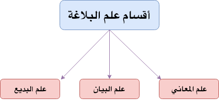

**Balagha**{: .firstword} Or **البلاغة**{: .firstword} is a الكلام or Speech that affects us, moves us, etc.

 

To understand it better, let's take a step back and look into how we communicate,
- We have thoughts/feelings/emotions inside us, we call it المعنى في النفس
- To express those thoughts/feelings/emotions, we use language, i.e. اللغة. So اللغة is a medium for الاتصال (communication)

 

This entire process is known as البيان, i.e., the ability to express meaning in the اللغة 

 

We may have a turmoil going on inside ourselves but to express that emotion we may say, "I'm happy" Or "I'm Sad" etc. From this, we establish that اللغة is weaker than المعنى في النفس. 

 

But if we are able to make اللغة stronger to carry more of المعنى في النفس. Then that اللغة is الكلام العالي.

 

That is where the study of علم البلاغة fits in. We try to make our اللغة more effective in conveying the المعنى في النفس.

 

Historically, علم البلاغة started to learn إعجاز القرآن الكريم. Allah SWT has challenged the Arabs to compete in البيان of the Quran in there own style.

 

Arabs at that time of the revelation of the Quran were the masters of the Arabic language. Some of the best poets for example امرؤ القيس, زهير, النابغة, لبيد  ,كعب بن زهير lived that time.

 

When Arabs heard the Quran, they understood that this is not the work of a human.

 

Imagine a situation in which a person heard a page of Quran or couple of Ayats, and he is ready to leave his previous beliefs, his city, etc. That was the effect of Quran on Arabs. For example, Umar ibn Khattab (RA) just heard few Ayats of Surah Taha and became Muslim.

 

So to answer,

## Why we study Balagha?
We say we study Balagha so that,
- We know the الكلام البليغ from الكلام الضعيف
- We can use البلاغة to make our speech beautiful

 

Before moving any further, let's understand the terms الفصاحة and البلاغة and the difference between them.

## الفصاحة
الفصاحة comes from the word أفصَح  يفصِح  أفصح  الإفصاح meaning أبان وأظهر

 

الفصاحة is studied under three heads
- فصاحة الكلمة (eloquence of word)
- فصاحة الكلام (eloquence of speech)
- فصاحة المتكلم (eloquence of speaker)

 

Let's begin with

### **فصاحة الكلمة**

**Rule 1**{: .heading1} **عدم تنافر الحروف**  
There should be no تنافر in الحروف. By تنافر, we mean mutual aversion, discord between the letters. For, e.g. word, مستشزرات is different to pronounce.

 
We should avoid تنافر because it makes the word heavy on the tongue to pronounce.

 

**Rule 2**{: .heading1} **مخالفة القياس**  
If we come with a word that doesn't match the rules, then it is مخالفة القياس. For e.g., Plural of بوق is أبواق, so if we use بوقات in place of أبواق then it is مخالفة القياس

 

**Rule 3**{: .heading1} **الغرابة**  
الغرابة mean to use strange words in a sentence. For e.g. using تكأكأ (to gather) 

### **فصاحة الكلام**
**Rule 1**{: .heading1} **عدم تنافر الكلمات**  
There should be no تنافر in الكلمات. By تنافر, we mean we do not put words together in الكلمات which makes it hard on the tongue.  

 

For e.g., a tongue twister like  

`قبر حرب بمكان قفر    وليس قرب قبر حرب قبر`

 

**Rule 2**{: .heading1} **ضعف التأليف Or مخالفة النحو المشهور**  
If we make a sentence against a rule in Nahw.  
In ضعف التأليف, our sentence is correct, but we have contradicted an important rule in Nahw.

 

**Rule 3**{: .heading1} **التعقيد**  
After reading a text, If we are not clear what the speaker wanted, i.e. الكلام صعب الفهم.

### **فصاحة المتكلم**
It is the ability of the speaker to be able to express what he wants with الكلام فصاحة in any field or area.

 

> قدرة المتكلم على التعبير عما يريد بكلام فصيح

## البلاغة
البلاغة comes from the word بلَغ  يبْلُغ  البُلُوغ meaning وصل (to reach).   
For e.g., بلغت مكة == وصلت إلى مكة  
It can be understood under two heads
- بلاغة الكلام
- بلاغة المتكلم

 

PS: We don't have the concept of بلاغة الكلمة because when we can't reach/affect someone's heart with one word. We need a sentence for that

 

Let's begin with

### **بلاغة الكلام**
بلاغة الكلام implies using the right style in the right place. Arabs say, "لكلِ مَقَام مَقَال" meaning for every situation there is a قول. 

> أن يكون الكلام مناسباً لما تريد أن تقوله مع الفصاحة

 

For e.g., in the Quran the same story is being told in different places with different styles, different words, the different type of Tawkeed, etc.

### **بلاغة المتكلم**
It is the ability of the speaker to be able to express what he wants with الكلام بليغ in any field or area.

 

> قدرة المتكلم على التعبير عما يريد بكلام بليغ

 

Finally, البلاغة is studied under 3 main heads.

## أقسام علم البلاغة
- (علم المعاني(علم معاني النحو
- علم البيان
- علم البديع

{:title="3 Divisions of Balagha"}

We will try to cover each topic individually in a separate post. Till then  
Happy Learning !!!

## Reference
- [Qutoof Academy](https://www.qutoofacademy.com/){:target="_blank" rel="nofollow noopener"}